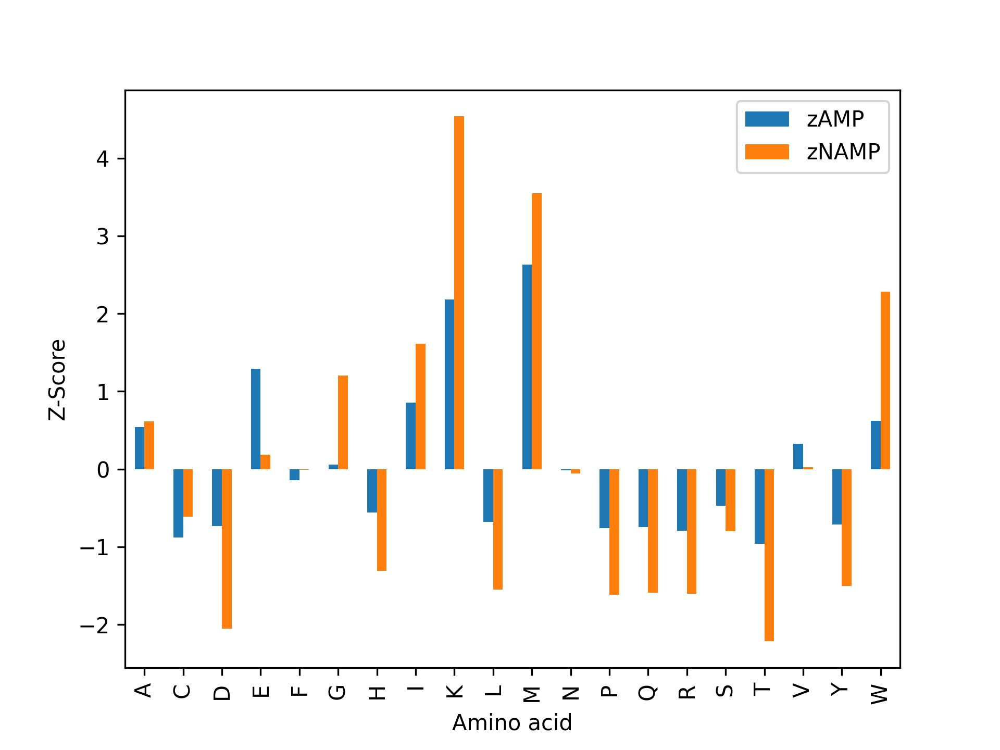
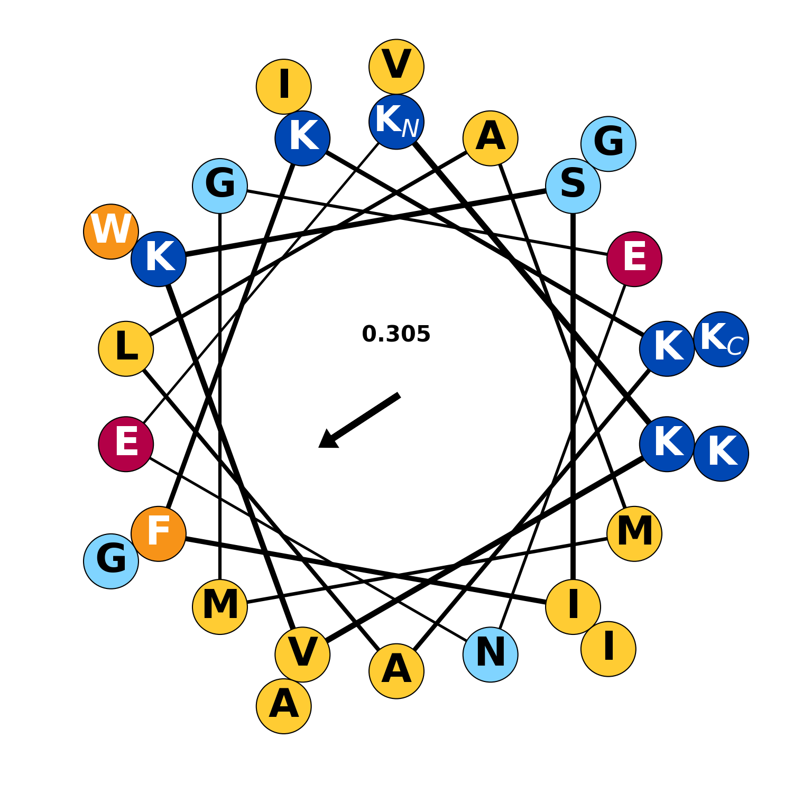
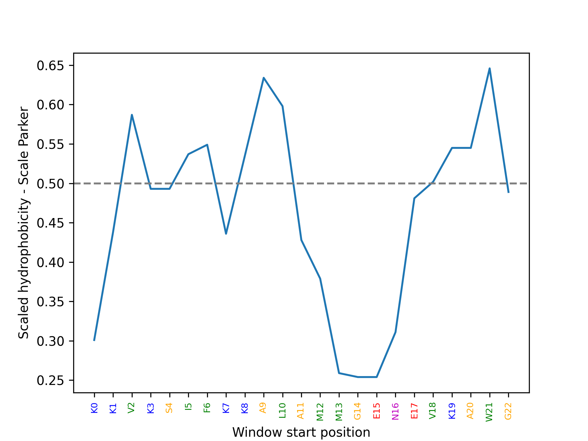
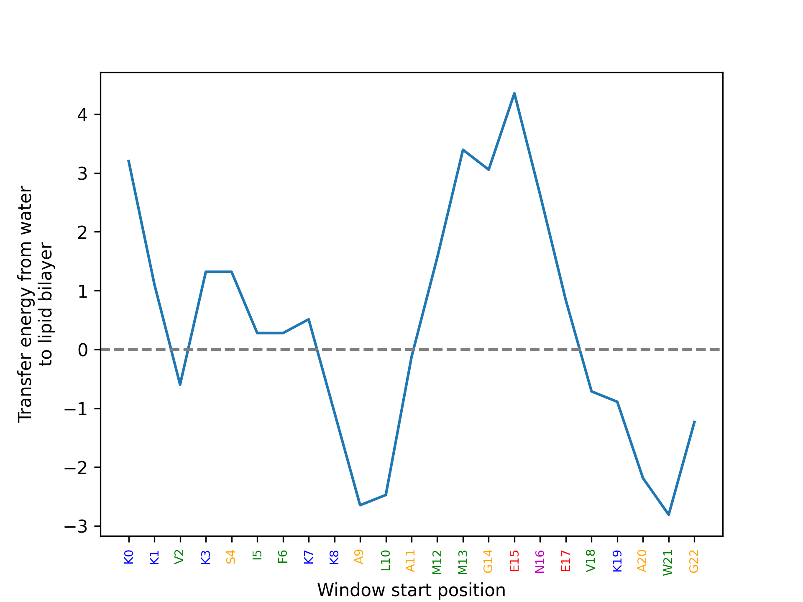
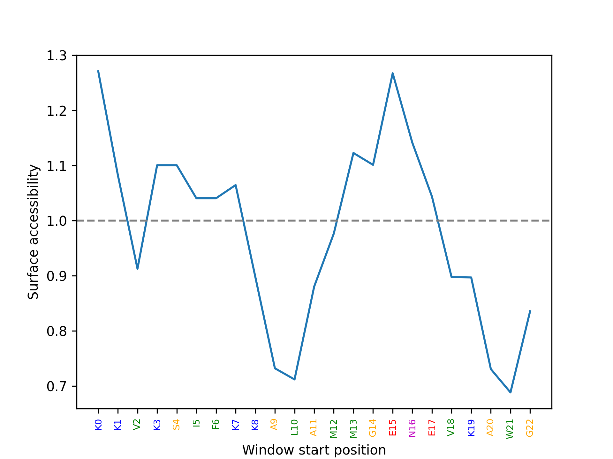
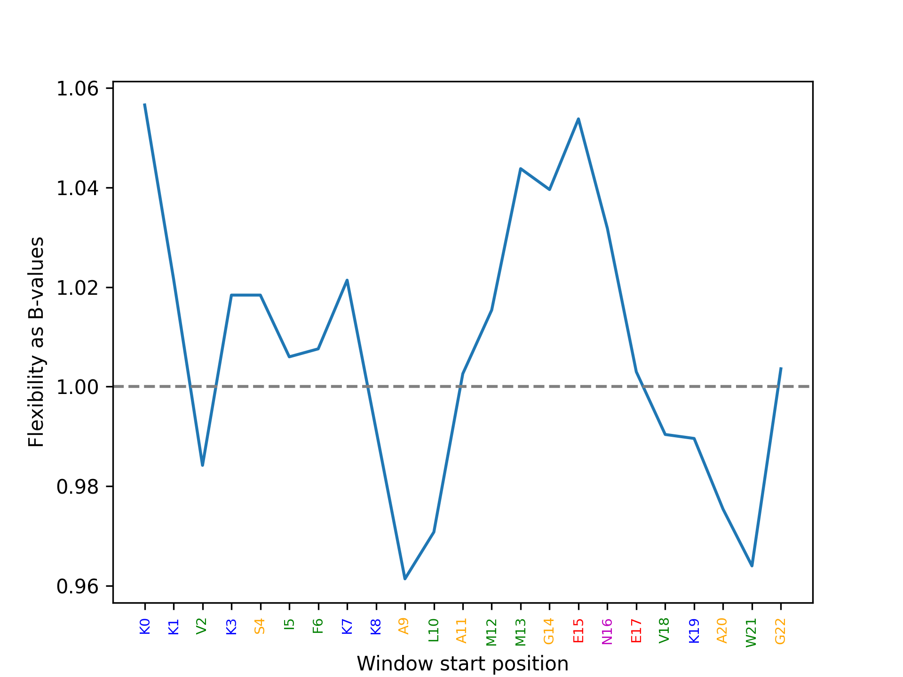

# Help for AMP pages

AMPSphere has different pages with information of AMPs about
their biochemistry and sequence organization to obtain the best
insights from each sequence. This information is divided into
numerical values and graphical. Below, we detailed point by point
their meaning, origin, and how to use them.

---

## The AMP info cards

AMPSphere brings analyses for each AMP sequence organized as cards, for example:

```
        ---------------------------------------------------------
        [PROC] -- AMP10.000_000
        ---------------------------------------------------------
        sequence = KKVKSIFKKALAMMGENEVKAWGIGIK
        MW = 3.01 kDa
        Length = 27
        Molar extinction = (5500, 5500)
        Aromaticity = 0.07407407407407407
        GRAVY = -0.11111111111111117
        Instability index = -18.348148148148148
        Isoeletric point = 10.12554931640625
        Charget at pH 7.0 = 4.758729531142717

        ---------------------------------------------------------
        Secondary Structure Assessment

        helix: 29.629629629629626
        turn: 18.51851851851852
        sheet: 29.629629629629626
        ---------------------------------------------------------
```

These results obtained using ProtParam include the molecular weight,
theoretical pI, instability index, aliphatic index, and grand average
of hydropathicity (GRAVY).

The molar extinction comes from the Lambert-Beer law and indicates how
much light a protein absorbs at a given wavelength. It helps in the
determination of protein concentration in water or diluted solutions
from its absorbance. The molar extinction coefficient assesses the protein
contents of tyrosine, tryptophan, and cystine (because cysteine does not
absorb light considerably at wavelengths >260 nm). Protein molar extinction
coefficients used the Edelhoch method ([Edelhoch (1967)](https://pubmed.ncbi.nlm.nih.gov/6049437/)),
with the extinction coefficients for Trp and Tyr determined by
[Pace et al. (1995)](https://pubmed.ncbi.nlm.nih.gov/8563639/). The calculus
can be simplified by:

```
	Extinction coefficient = (#Tyr)*Ext(Tyr) + (#Trp)*Ext(Trp) + (#Cystine)*Ext(Cystine)

	where (at 280 nm):

		Ext(Tyr) = 1490
		Ext(Trp) = 5500
		Ext(Cystine) = 125
```

The absorbance (optical density) is calculated using the following formula:

```
	Absorb(Prot) = extinction coefficient / molecular weight

```

ProtParam produces two values: one assuming all cysteine residues appear as
half cystines, and the second, that no cysteine appears as half cystine.

The aromaticity is calculated as described by [Lobry, 1994](https://pubmed.ncbi.nlm.nih.gov/8065933/)
and is the relative frequency of Phe + Trp + Tyr in the entire sequence.
Higher values of this parameter can lead to less soluble proteins.

The Grand Average of Hydropathy (GRAVY) value for a peptide or protein described in
[Kyte and Doolittle (1982)](https://pubmed.ncbi.nlm.nih.gov/7108955/) consists of
summing the hydropathy values of each residue in the peptide and dividing by its length.

The instability index (II) measures the peptide stability in a test tube considering the
statistical analysis of 12 unstable and 32 stable proteins
([Guruprasad et al., 1990](https://pubmed.ncbi.nlm.nih.gov/2075190/)). The analysis revealed
certain dipeptides significantly happening in the unstable proteins when compared with
stable ones. Thus, the 400 different dipeptides (DIWV) assigned to values measuring their
instability take place in the II calculus as follows:

```
              i=L-1
II = (10/L) * Sum  DIWV(x[i]x[i+1])
              i=1

where:

	L is the length of the sequence

	DIWV(x[i]x[i+1]) is the instability weight
                         value for the dipeptide
                         starting in position i.
```

II less than 40 predicts a protein as stable.

Protein isoelectric point (pI) calculated using pK values of amino acids described in
Bjellqvist et al.([1993](https://pubmed.ncbi.nlm.nih.gov/8125050/) and
[1994](https://pubmed.ncbi.nlm.nih.gov/8055880/)) in pH 7.0 at 25°C. This method is
from [Bio.SeqUtils.ProtParam](https://biopython.org/docs/1.75/api/Bio.SeqUtils.ProtParam.html).
The charge of a protein at given pH is calculated as a derivation of Henderson-
Hasselbalch equation:

```
	pH = pKa + log([A-]/[HA])

	Rearranging:

		[HA]/[A-] = 10 ** (pKa - pH)

	partial_charge =

		[A-]/[A]total = [A-]/([A-] + [HA]) = 1 / { ([A-] + [HA])/[A-] } =
		1 / (1 + [HA]/[A-]) = 1 / (1 + 10 ** (pKa - pH)) for acidic residues;
                                      1 / (1 + 10 ** (pH - pKa)) for basic residues


        charge = positive_charge - negative_charge

```

Molecular weight (MW) values are in thousands of Daltons (kDa) and was obtained by
adding the average isotopic masses of amino acids in the protein and one water molecule.

The secondary structure of the peptide, in AMPSphere, is a percent composition of a
protein taking amino acids which tend to be in Helix, Turn, or Sheet. It follows the groups
of amino acids belonging to helix (V, I, Y, F, W, L), turns (N, P, G, S), and
sheets (E, M, A, L).

**Be aware that:**

  + The current predictions may not be adequate for very alkaline proteins.
  + pI predictions for small proteins can be problematic.
  + It is not taken into account the effects of post-translational modifications.
  + The molar extinction calculus assumes that no other chromophores that absorb at 280 nm are present in the protein.
  + Molar extinction can have more than 10% error for proteins without Trp residues.

---

## Graphs in AMP cards

The amino acids compositional deviation was calculated using the Z-score calculated from
two different groups (AMPs and non-AMPs) previously used in the training set of Macrel
models (**Fig. 1**).

<figure class="figure">
    
    <figcaption class="figure-caption">Fig. 1. Compositional deviation of peptide AMP10.000_000
	    from Macrel's training set of AMPs and non-AMPs.<br></figcaption>
</figure>

<br/>This method consists of calculating the average percent composition of AMPs
and non-AMPs separately per amino acid. Then using the Z-score:

```

	Z-score(amino acid x) = (X% - Xmu) / Xstd

	where:

		X% - amino acid X percent composition in the protein

		Xstd - standard deviation of amino acid X percent composition
                       of the set of AMPs or NAMPs in the training set used in
                       Macrel models

		Xmu - average amino acid X percent composition of the set of
                      AMPs or NAMPs in the training set used in Macrel models 

``` 


A negative Z score means that a specific amino acid decreased compared with the average training
set for AMPs or non-AMPs. On the other side, a positive Z-score means the opposite, the increment
of some amino acid compared to the average training set. Whether the Z-score is around zero, then
the peptide composition is close to the average training set.

We produced Z-score graphs to compare AMPs with the training set used by Macrel of AMPs and
non-AMPs, placing a given peptide in this background (**Fig. 2**). The average and standard
deviation for each of the features calculated from Macrel's training set were used to derive
the Z-scores for AMPs and non-AMPs. These Z-scores were plotted for each variable and grouped
by color (black for AMPs and gray for non-AMPs, respectively). Among the several different
tested features, some of them were already above mentioned in detail.

<figure class="figure">
    
    <figcaption class="figure-caption">Fig. 2. Z-score comparison of (a) aliphatic index,
	    (b) Boman index, (c) hydrophobic moment, (d) instability index - instaindex,
	    (e) isoelectric point, and (f) charge using the average of complete training
	    set separated by non-antimicrobial peptides (gray), antimicrobial peptides
	    (black) and dots representing the peptide as a red star - in this example,
	    AMP10.000_000.</figcaption>
</figure>

<br/>The aliphatic index (AI) consists of the relative volume occupied by aliphatic side chains from
Ala, Val, Leu/Ile. It correlates positively with the increasing thermostability of globular proteins.
Then, it is possible to compare this parameter with the population of AMPs and non-AMPs sorted by length
and again using the same rationale for Z-scores (**Fig. 2a**) AI can be calculated using the method from
[Ikai (1980)](https://pubmed.ncbi.nlm.nih.gov/7462208/), as follows:

```
  AI = X(Ala) + a * X(Val) + b * ( X(Ile) + X(Leu) )  

  where
  
        X(Ala), X(Val), X(Ile), and X(Leu) are mole percent of those amino acids (100 X mole fraction) 
        a (= 2.9) represents the relative volume of the side chain of valine to alanine
        b (= 3.9) represents the relative volume of the side chain of leucine/isoleucine to alanine 
```

In **Fig. 2b** it is possible to observe the placement of the tested sequence among AMPs and non-AMPs using
the Boman index. This index, proposed by [Boman (2003)](https://pubmed.ncbi.nlm.nih.gov/12930229/), is the
propensity of a peptide interacting with protein receptors or membranes. Boman index is the sum of the
solubility values for all residues in a sequence divided by the number of residues. For reference, indices
above 2.48 mean that the protein has high binding potential.

The hydrophobic moment (H-moment) distribution in **Fig. 2c** detects the periodicity of hydrophobic residues
of a protein. It measures the amphiphilicity perpendicular to the axis of any periodic peptide structure
(a-helix or b-sheet). H-moment is especially useful to characterize AMPs, as their hydrophobic residues
usually are arranged in a side of these structures.

The standardized hydrophobicity scale developed by [Eisenberg (1984)](https://pubmed.ncbi.nlm.nih.gov/6582470/)
is used to calculate the H-moment. The hydrophobicity of each residue in a protein window multiplied by their
unit vector sums up the final H-moment. The unit vectors are the angular momentum to the nucleus of the alpha-
carbon toward the geometric center of the side chain. Simplifying, it is obtained as follows:

```
    H-moment = sum(Hn*Sn)
    
    H-moment = sum(Hn*sin(delta))**2 + sum(Hn*cos(delta))**2
    
    where:
            Hn is the hydrophobicity of the residue n

            sin(delta) is the sine of the angle delta in radians
                       having the periodic structure divided into
                       windows (100°)

            cos(delta) is the cosine of the angle delta in radians
                       having the periodic structure divided into
                       windows (100°)
```

The charge, instability index, and isoelectric point were calculated as mentioned
in the previous section and compared against AMP and non-AMP sets using Z-score as
shown in **Fig. 2d-f**.

Usually, in globular proteins, helices have one face oriented toward the hydrophobic
core and the other is solvent-exposed. The helical wheel (**Fig. 3**) illustrates this
property of alpha-helices, through the concentration of hydrophobic amino acids on one
side of the helix, with polar or hydrophilic amino acids on the other. 

<figure class="figure">
    
    <figcaption class="figure-caption">Fig. 3. Amino acids helical wheel with the H-moment indicated.</figcaption>
</figure>

<br/>Helical wheels draw the protein residues in a rotation of 100° between consecutive amino acids.
The H-moment and direction showed inside the wheel point to its maximum momentum. **Fig. 3** plotted
using [modlAMP](https://doi.org/10.1093/bioinformatics/btx285) has a color code for amphiphilicity
of residues available in the module as it follows:

```
The amphipatic color code from modlAMP uses 8 colors:

G, A                        Beige
N, Q                        Purple
S, T                        Pink
K, R                        Blue
H                           Light blue
D, E                        Bordeaux
P                           Green
F, L, W, M, V, I, C, Y      Yellow
```

**Figures 4-7** compute a profile by residues using scanning with fixed window size and different
scale parameters. An amino acid scale is a numerical value assigned to each type of amino acid
according to some specific feature in which they are classified or measured. To make a profile we
also can use sequence positions or even the amino acids sequence colored by amino acids properties.
In the above-mentioned figures we used Lesk's color scale to code sequences in the X-axis as follows:

```
The colour scheme from Lesk

It uses 5 groups (note Histidine): 

    Small nonpolar        G, A, S, T                    Orange
    Hydrophobic           C, V, I, L, P, F, Y, M, W     Green
    Polar                 N, Q, H                       Magenta
    Negatively charged    D, E                          Red
    Positively charged    K, R                          Blue
    
```

Our calculations used the algorithm implemented in [ProtScale](http://www.expasy.org/cgi-bin/protscale.pl),
in which for a window size n, we use the i-(n-1)/2 neighboring residues on each side to compute the score
for i.

The hydrophobicity scale adopted in the AMPSphere ([Parker et al., 1986](https://pubmed.ncbi.nlm.nih.gov/2430611/))
and used in **Fig. 4**. is derived by measuring HPLC retention times of peptide libraries. It presents two
adjacent copies of a variable residue in a random coil peptide, one more exposed located toward the N-terminus
of the peptide and one packed between the other copy of the tested residue and a Leucine residue
(Ac–GXXLLLKK–amide).

<figure class="figure">
    
    <figcaption class="figure-caption">Fig. 4. Profile of hydrophobicity of residues of AMP10.000_000 using the
	    relative scale of Parker.</figcaption>
</figure>

<br/>This scale is interesting to understand whether hydrophobic or hydrophilic stretches are present in the
peptide. If the hydrophobicity is above 0.5, it is considered hydrophobic
([Pane et al., 2017](https://doi.org/10.1016/j.jtbi.2017.02.012)).

The profile of residues free energy of transfer from water to membrane lipid (Ez) in **Fig. 5** was conceived
initially by [Senes et al. (2007)](https://pubmed.ncbi.nlm.nih.gov/17174324/). Ez estimated by a reverse-Boltzman
relationship of potential can be calculated from the propensities for the occurrence of each residue as a function
of their depth in the lipid bilayer [Senes et al. (2007)](https://pubmed.ncbi.nlm.nih.gov/17174324/).AMPs need to
have low free energy for transfer to easily insert themselves in the lipid membranes, triggering their effects. 
The scale adopted in **Fig. 5** is the same as in [modlAMP](https://doi.org/10.1093/bioinformatics/btx285).
  
<figure class="figure">
    
    <figcaption class="figure-caption">Fig. 5. Profile of AMP10.000_000 residues free energy of transfer from water
	    to membrane lipid.</figcaption>
</figure>

<br/>In a complementary way to hydrophobicity, solvent accessibility (SA) can show which residues are exposed or buried,
as shown in **Fig. 6**. It uses the Emini Surface fractional probability (EM) scale in the
[Bio.SeqUtils.ProtParam](https://biopython.org/wiki/ProtParam) module. The scale used is that in
[Emini et al. (1987)](https://pubmed.ncbi.nlm.nih.gov/2991600/) based on the formula:

```
  Sn = (n+4+i)*(0.37)-6
  
  where
        Sn is the surface probability of residue n
        dn is the fractional surface probability value of the amino acid n
        i vary from 1 to 6 depending on its position in the window
```

SA values greater than 1.0 indicate an increased probability of being found on the surface. AMPs present an interesting
periodicity of exposed and buried motifs, which arguments in the sense that they can form secondary structures and
possibly interact with membranes and the extra/intra-cellular milleu.

<figure class="figure">
    
    <figcaption class="figure-caption:bold">Fig. 6. Profile of solvent accessibility of residues of AMP10.000_000.</figcaption>
</figure>

<br/>The calculated flexibility profile (**Fig. 7**) shows regions submitted to higher tensions in the molecule
and those able to move the rigid structure into a more favorable conformation. Therefore, accurate analysis of
the peptide flexibility can lead to valuable ideas of how the peptide can fold and conformationally adjust. The
normalized flexibility parameters (B-values) from
[Vihinen (1994)](https://onlinelibrary.wiley.com/doi/10.1002/prot.340190207) was the scale adopted in the
profile calculation.

<figure class="figure">
    
    <figcaption class="figure-caption">Fig. 7. Profile of flexibility of residues of AMP10.000_000.</figcaption>
</figure>

---

## References

Authors of AMPSphere claim no authorship over the methods here cited and attributes merit who deserves it.
The methods here referenced can be found further explained in the links below:

 + [Expasy](https://web.expasy.org/)
 + [ProtParam tool](https://web.expasy.org/protparam/)
 + [Bio.SeqUtils.ProParam](https://biopython.org/docs/1.75/api/Bio.SeqUtils.ProtParam.html)
 + [Peptides R Package](https://cran.r-project.org/web/packages/Peptides/Peptides.pdf)
 + [modlAMP documentation](https://modlamp.org/)
 + [Macrel](macrel.readthedocs.io/)
